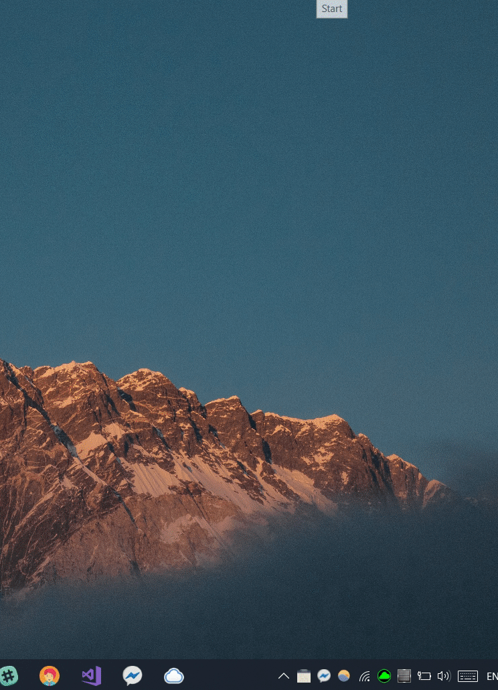

# Cate Desktop

<p align="center">
    
</p>

## Setup

Needs `config.js`, I have provided the template `config.temp.js`. 

Need a `config.js` file that reads like this:

``` js
var username = "YOUR_USERNAME"
var password = "YOUR_PASSWORD"
var year = "ACADEMIC_YEAR"
module.exports = {
    username, password, year
}
```

## I have Electron, quick start?

`electron .`

## Install Electron?

`npm install electron --save-dev --save-exact --global`

Global installation better so you can use `electron` CLI.

## Create app for actual use?

You need electron-packager.

`electron-packager . Cate`

## Close?

Right click tray icon.

## Credits

Uses electron. Icon made by Smashicons from www.flaticon.com.